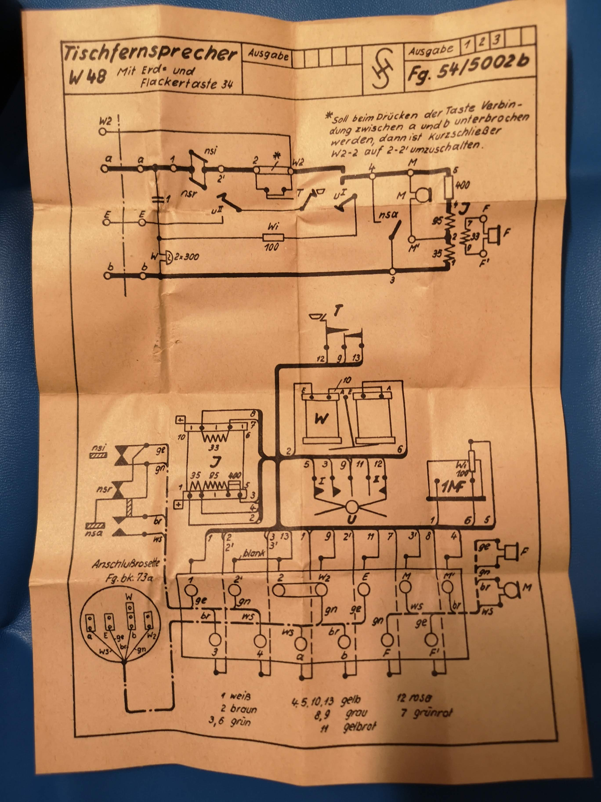
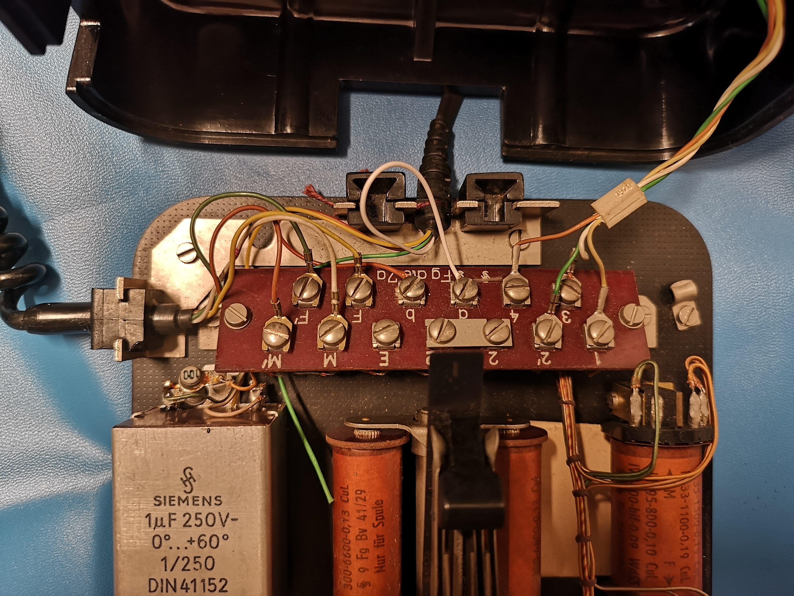
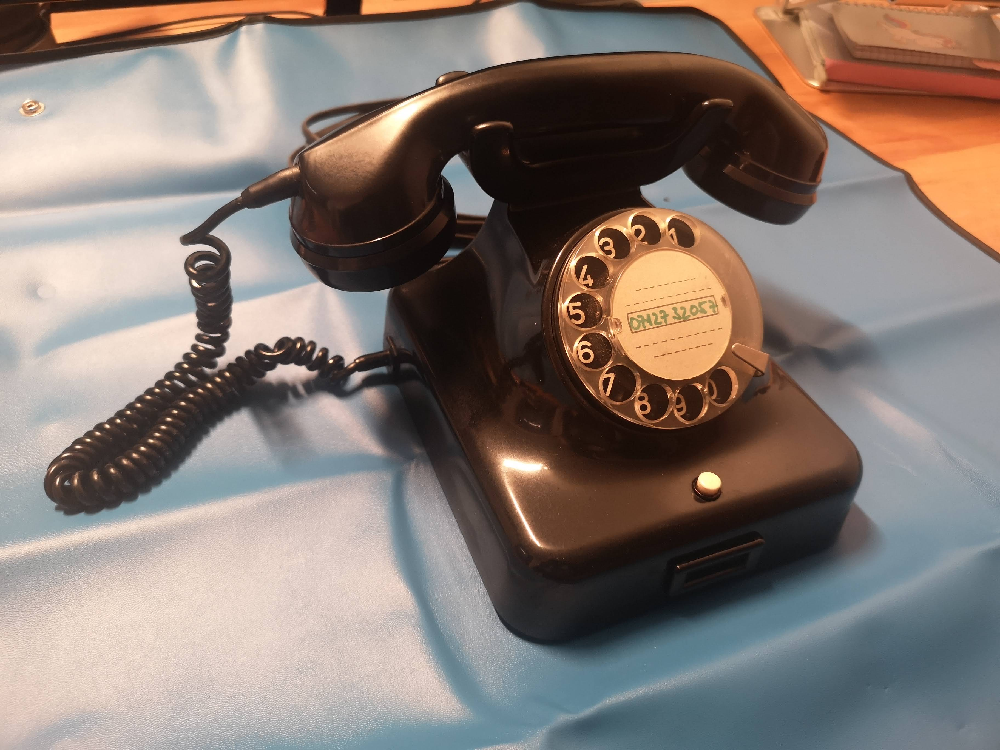
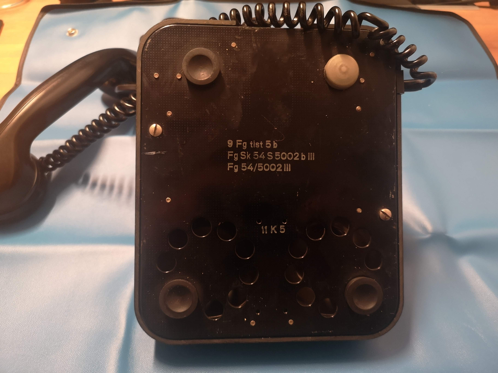
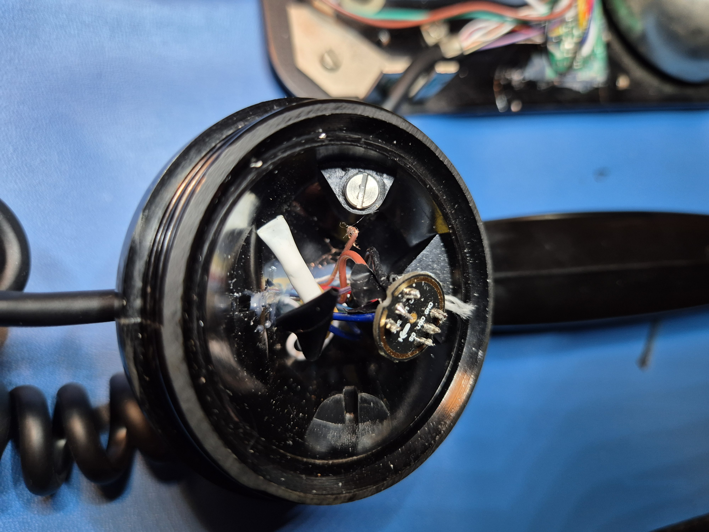
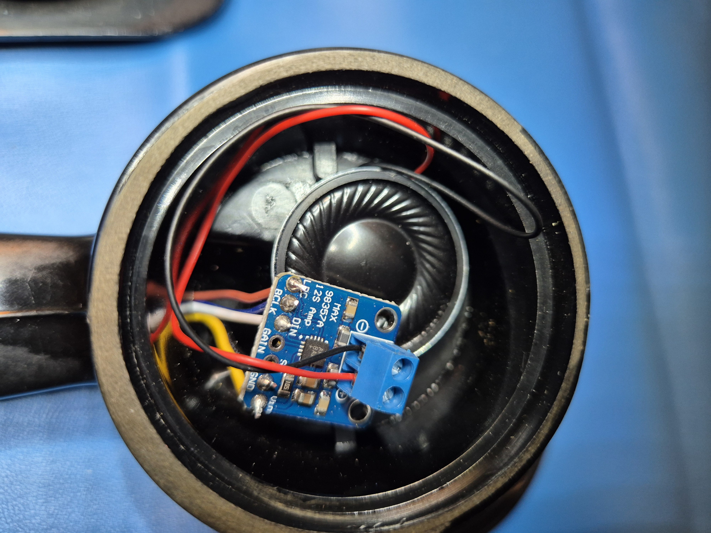

# 📞 TischfernsprecherW48-Voice-Assistant 🗣️
Modification of a vintage "Tischfernsprecher W 48" telephone into a HomeAssistant-compatible voice assistant device

## 📝 Detailed Description
This project transforms the vintage "Tischfernsprecher W 48" telephone into a voice assistant. The device listens only when the handset is lifted, making it intuitive and eliminating the need for a wake word. Additionally, it combines the charm of a vintage telephone with modern functionality. ✨

## 🛠️ Hardware Used
* [diymore ESP32 S3 DevKitC 1 N16R8 ESP32 S3 WROOM1 N16R8](https://www.amazon.de/gp/product/B0CLD4QKT1)
* [AZDelivery MAX98357A I2S 3W Mono Amplifier Class D](https://www.amazon.de/dp/B09PL7DSK5)
* [ARCELI 3PCS INMP441 Omnidirectional Microphone Module, I2S](https://www.amazon.de/dp/B0CH2TYXCZ)
* [Weewooday 6 Pieces 2W 8 Ohm Speaker](https://www.amazon.de/dp/B09MRK24PP)
* [chenyang RJ45 Stretch Spiral Cable Cat6 8P8C UTP](https://www.amazon.de/dp/B0CF2B2PCK) (at least 2 meters, 7 wires needed)

## 💻 Software Used
* [ESPHome](https://esphome.io/) **2026.4.0 or newer**, running as a Home Assistant add-on 🏠
* [YAML configuration file](tischfernsprecher-w48.yaml) 📄

### ⚙️ Setup
1. Copy [`secrets.yaml.example`](secrets.yaml.example) to `secrets.yaml` next to the configuration and fill in your Wi-Fi credentials and an API encryption key (generate one with `openssl rand -base64 32`). `secrets.yaml` is git-ignored and must stay out of the repository. If you are updating an existing device, reuse the key it already has — a new key means Home Assistant can no longer reach the device.
2. Adopt the configuration in the ESPHome dashboard and flash the device. It joins the configured network on its own; if that network is unreachable it opens its own access point and serves a captive portal, so it can be recovered without opening the housing.
3. In Home Assistant, assign an Assist pipeline to the device. Lifting the handset starts the pipeline — there is no wake word.

> **ESPHome version.** This configuration uses the current audio stack (`speaker` plus `media_player: speaker`). The older `media_player: i2s_audio` platform was **removed in ESPHome 2026.4.0**, so anything built from an earlier revision of this repository will no longer compile. The ESP-IDF framework and PSRAM are required and are already set in the configuration.

### 🔄 Upgrading from an earlier revision

Anyone who built this device before the 2026 rewrite is on the old node name `esphome-web-c7b550`. The node is now called `w48-phone`, which means Home Assistant creates a fresh set of entity IDs (`binary_sensor.w48_phone_handset`, `media_player.w48_phone_speaker`, and so on) and leaves the old ones behind as unavailable.

After flashing, expect to:

1. Delete the orphaned entities of the old node in Home Assistant.
2. Re-point anything that referenced the old IDs — dashboards, automations, and the player entry in Music Assistant.
3. Re-assign the Assist pipeline and the area to the device.

If you would rather keep your existing entity IDs, set `substitutions: name:` back to your old node name before flashing. Everything else in this configuration works either way.

> **Optional: using the full 16 MB of flash.** `flash_size` is deliberately left at its default so that updates can be installed over the air. Setting `flash_size: 16MB` changes the partition table, and partition tables are not written during an OTA update — that change requires flashing over USB once.

## 🔧 Assembly Instructions
I removed the internal components of the telephone and replaced them with the new technology. Please refer to the uploaded images for detailed steps. 🔩

Feel free to use [my Fritzing file](Fritzing/Voice%20Assistant%20W48%20verkürzte%20Kabelwege.fzz).

<table>
  <tr>
    <td align="center">Original plan </td>
    <td align="center">Fritzing Schaltplan </td>
    <td align="center">Fritzing Steckplatine </td>
    <td align="center">Before - Main </td>
    <td align="center">Before - Overview </td>
  </tr>
  <tr>
    <td align="center">Before - Serial </td>
    <td align="center">After - Main </td>
    <td align="center">After - Microphone </td>
    <td align="center">After - Overview </td>
    <td align="center">After - Speaker </td>
  </tr>
</table>

## 💡 Usage Notes
Improvements are welcome! 🙌 The internal assembly could be more space-efficient, allowing the bell 🔔 to be operated with an electromagnet. A custom PCB design could also be beneficial. Ensure proper strain relief for the spiral cable. The cable I used conveniently included a rope, allowing strain relief in the handset with a screw and hot glue. 👍

## 📄 License

This project is licensed under the [Creative Commons Attribution-ShareAlike 4.0 International License](LICENSE) (CC BY-SA 4.0) — the ESPHome configuration, the documentation, the photos and the Fritzing file alike.

You are free to share and adapt the material, including commercially, as long as you give appropriate credit and distribute your contributions under the same license.

Attribution: *TischfernsprecherW48-Voice-Assistant* by [GpsM2](https://github.com/GpsM2), licensed under CC BY-SA 4.0.
